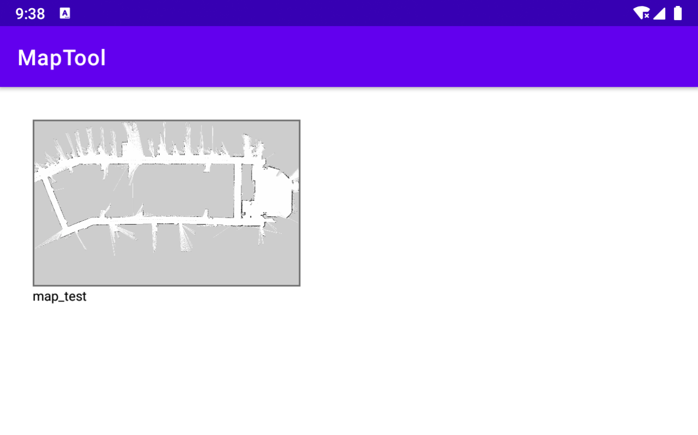
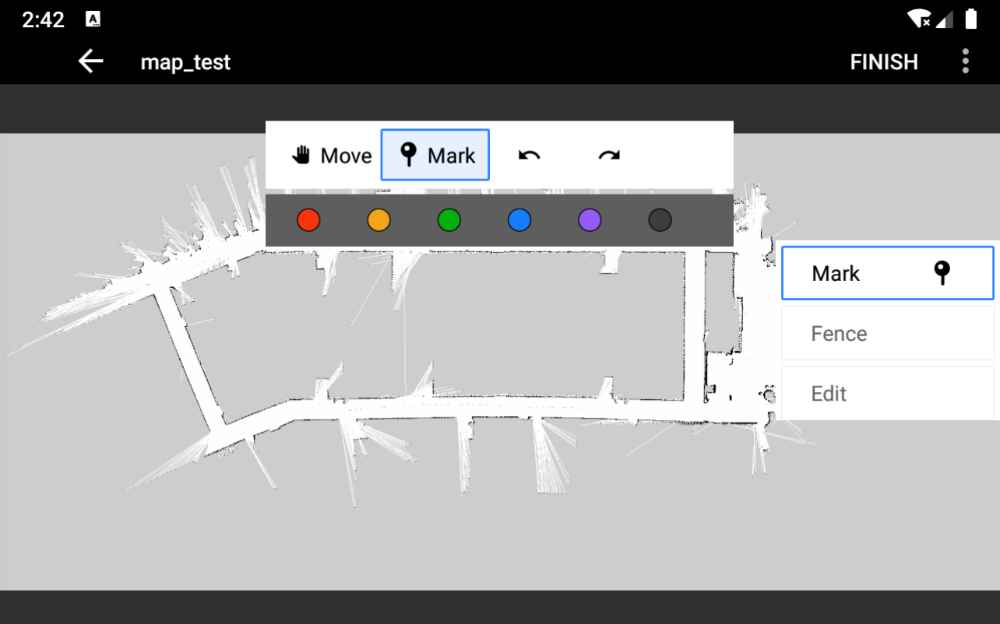
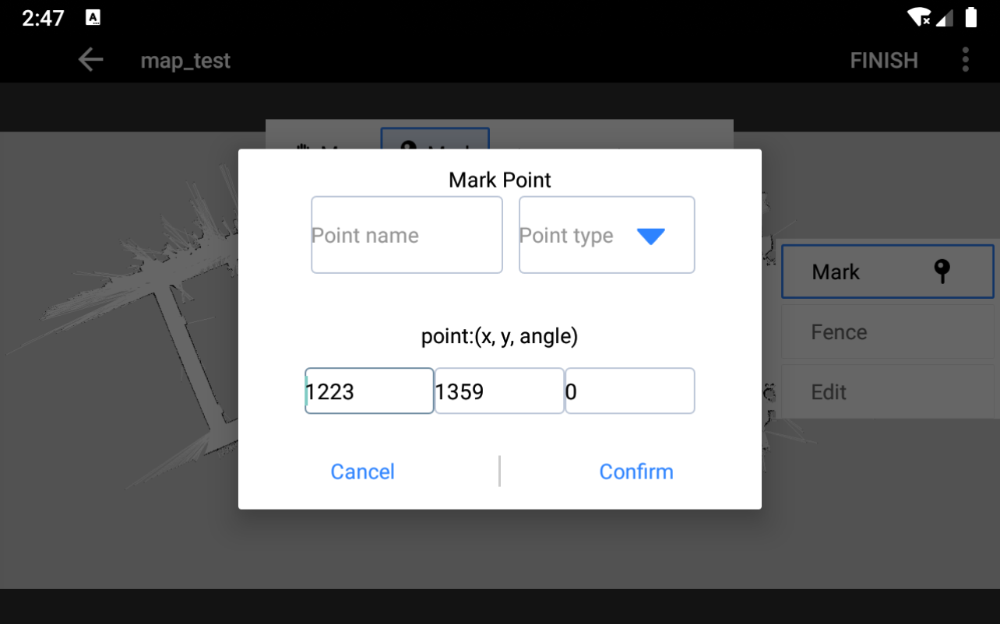
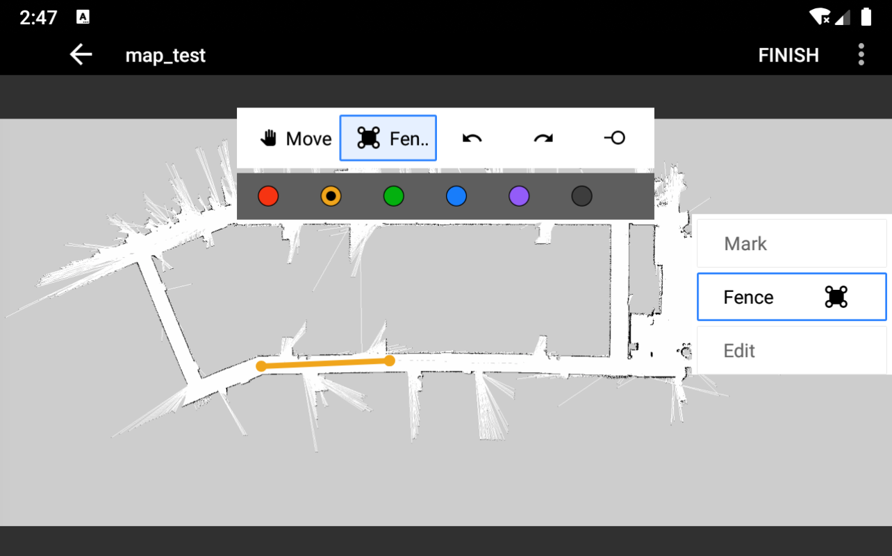
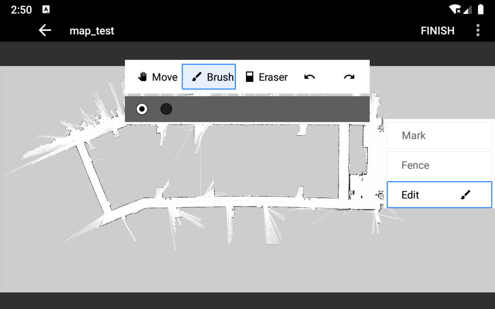
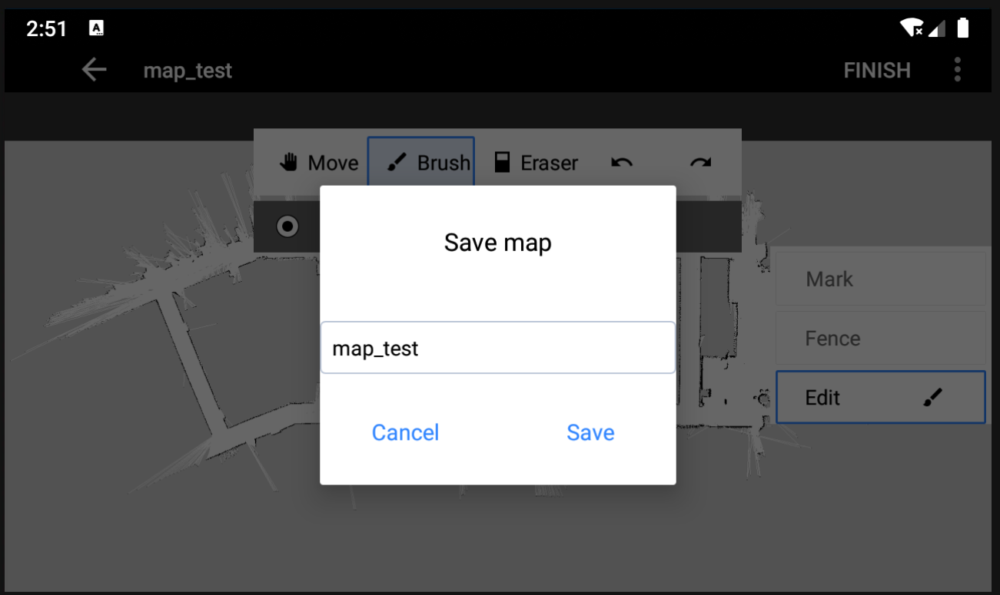

# MapTool
MapTool is an Android app for editing grip-map of robotics

MainActivity
Display the map list. When there is no map in the local (./MapTool/), load the prefabricated image
.\res\drawable\map_thumb_demo.png.
Click on the map to enter the map editing interface EditMapActivity.
显示地图列表，本地（./MapTool/）还没有地图时，加载预制图片.\res\drawable\map_thumb_demo.png
点击地图进入地图编辑界面EditMapActivity

EditMapActivity
Three editing functions on the right side: Point of Interest layer (Mark), Virtual Wall layer (Fence), and Map Editing layer (Edit).
右侧三层编辑功能：兴趣点层（Mark），虚拟墙层（Fence）,地图编辑层（Edit）

兴趣点层（Mark）：
Select the color, click on any point on the map to add a point of interest, and add the name and information of the point of interest in the pop-up dialog box.
选择颜色，点击地图上任意点添加兴趣点，在弹出的对话框中添加兴趣点名称及信息

虚拟墙层（Fence）：
Select the color, click on any two points on the map, and connect them with a line.
选择颜色，点击地图上任意连个点，连成一条线

地图编辑层（Edit）

Click the FINISH button to complete the map editing, and fill in the map name in the dialog box.
FINISH按钮完成地图编辑，对话框中填写地图名称
